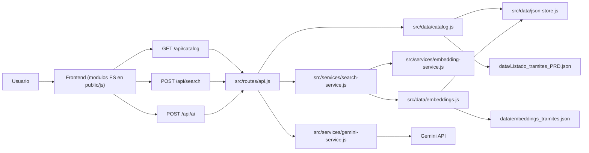

# Documentacion tecnica de TADI Search

## Objetivo

TADI Search es un mockup para evaluar una experiencia de busqueda de tramites TAD basada en tres mecanismos complementarios:

1. Busqueda predictiva con Fuse.js.
2. Busqueda semantica/textual con embeddings y refuerzo por coincidencia.
3. Analisis final con IA generativa.

La idea central es no depender de un unico ranking. Fuse.js recupera coincidencias textuales rapidas, la busqueda semantica/textual combina embeddings con coincidencias fuertes en nombre, keywords y descripcion, y Gemini decide entre candidatos reales del catalogo.

## Arquitectura



`server.js` solo hace el bootstrap (Express, middleware y montaje de `src/routes/api.js`). La configuracion (env, paths, limites y umbrales) se centraliza en `src/config.js`.

## Archivos principales

Backend, separado por capas:

```text
server.js
  Bootstrap: arma Express, monta middleware y rutas, levanta el server.

src/config.js
  Unica lectura de process.env: env, paths, limites y umbrales.

src/routes/api.js
  express.Router con /api/catalog, /api/search, /api/ai y /produccion. Controladores delgados.

src/data/json-store.js
  Lectura de JSON cacheada con invalidacion por mtime.

src/data/catalog.js
  Repositorio: lee y normaliza el catalogo PRD.

src/data/embeddings.js
  Repositorio: carga la base vectorizada y precalcula la norma de cada vector.

src/services/search-service.js
  Orquesta la busqueda semantica/textual y mapea los resultados al catalogo.

src/services/embedding-service.js
  Pipeline de embeddings, similitud coseno y refuerzo lexical.

src/services/gemini-service.js
  Construye prompts, llama a Gemini, valida la respuesta y la normaliza.

src/services/ai-usage-log.js
  Registra que se envio a Gemini y cuantos tokens reporto la API.

src/text-utils.js
  Re-export del modulo de texto compartido (shared/text-search.js).

scripts/generate-embeddings.js
  Regenera data/embeddings_tramites.json.
```

Capa compartida (carpeta neutral, fuera de src/ y public/):

```text
shared/text-search.js
  Primitivas de texto/scoring compartidas con el backend (UMD: Node por require, navegador
  por window.TadiText). El server la sirve en /shared.
```

Frontend, dividido en modulos ES:

```text
public/js/app.js
  Punto de entrada: init y wiring de eventos. Cargado como <script type="module">.

public/js/config.js
  Constantes de UI: SELECTORS, SEARCH_CONFIG, modo de vista.

public/js/text.js
  Adaptador de las primitivas compartidas como modulo ES.

public/js/state.js
  Estado compartido de la app.

public/js/dom.js
  Helpers de DOM: svg, escapeHtml, getLimit, ICONS.

public/js/api.js
  Cliente HTTP del backend (fetchCatalog, postSearch, postAI).

public/js/candidates.js
  Scoring para mostrar, filtrado para IA y fusion de candidatos.

public/js/logging.js
  Logs del flujo de busqueda en la consola del navegador.

public/js/catalog.js
  Carga de catalogo, indice Fuse.js, busqueda local y listado inicial.

public/js/render.js
  Renderizado de tarjetas, resultados, paginacion y tarjeta de IA.

public/js/autocomplete.js
  Sugerencias mientras se escribe y navegacion por teclado.

public/js/search.js
  Orquestacion de input, busqueda confirmada y consulta a IA.

public/css/app.css
  Estilos base compartidos y vista de testing con etiquetas de ranking.

public/production/index.html
  Entrada visual limpia para presentar la app sin etiquetas de testing.

public/production/styles.css
  Capa visual de la vista de presentacion TAD.

public/production/assets/
  Imagenes e iconos usados solo por la vista de presentacion.
```

## Datos usados

Catalogo fuente:

```text
data/Listado_tramites_PRD.json
```

Campos leidos:

```json
{
  "ID": 1,
  "NOMBRE_TRAMITE": "...",
  "DESCRIPCION_CORTA": "..."
}
```

Formato normalizado interno:

```json
{
  "id": 1,
  "nombre": "...",
  "descripcion": "...",
  "keywords": []
}
```

`DESCRIPCION_HTML` no se usa en el flujo actual.

## Configuracion editable

En `public/js/config.js`:

```js
const SEARCH_CONFIG = {
  predictiveVisibleLimit: null,
  fuseCandidateMinPercent: 46,
  includeExactNameWordsForAI: true,
  embeddingVisibleLimit: 50,
  embeddingCandidatesForAI: 10,
  aiCandidatesSentLimit: null,
  searchVisibleLimit: null,
};
```

Significado:

- `predictiveVisibleLimit`: cantidad mostrada mientras se escribe. `null` muestra todo.
- `fuseCandidateMinPercent`: umbral minimo de Fuse para candidato IA.
- `includeExactNameWordsForAI`: incluye candidatos si el nombre contiene todas las palabras de la busqueda.
- `embeddingVisibleLimit`: cantidad de resultados de busqueda semantica/textual pedidos al backend para visualizacion/testing.
- `embeddingCandidatesForAI`: cantidad de resultados de busqueda semantica/textual que entran como candidatos IA.
- `aiCandidatesSentLimit`: limite final de candidatos enviados a Gemini. `null` no recorta.
- `searchVisibleLimit`: limite visual despues de Buscar. `null` muestra todo lo disponible.

## 1. Busqueda Fuse.js

Implementacion:

```text
public/js/catalog.js     initFuse(), searchLocal()
public/js/candidates.js  enrichPredictiveResult(), getFuseCandidatesForSearch()
```

Campos usados:

- `nombre`, peso `0.55`.
- `descripcion`, peso `0.45`.

Configuracion Fuse:

```js
state.fuse = new Fuse(items, {
  keys: [
    { name: 'nombre', weight: 0.55 },
    { name: 'descripcion', weight: 0.45 },
  ],
  threshold: 0.42,
  minMatchCharLength: 2,
  includeScore: true,
  ignoreLocation: true,
});
```

Uso mientras se escribe:

- Se ejecuta en el navegador.
- Antes de consultar Fuse, se quitan palabras de intencion como `quiero`, `busco`, `hacer`, `necesito`, `tramite`, para que una frase como `busco hacer una partida` se busque como `partida`.
- Muestra coincidencias predictivas.
- Ordena por score interno de Fuse, de menor a mayor.
- La UI convierte ese score a `Fuse XX%` para que mayor sea mejor.

Detalle de limpieza:

```text
1. Convierte a minusculas.
2. Quita acentos.
3. Separa en palabras.
4. Elimina tokens de menos de 3 caracteres.
5. Elimina stopwords genericas de intencion, conectores y pronombres.
6. Une los terminos relevantes restantes.
```

Stopwords actuales:

```text
quiero, quisiera, deseo, necesito, necesitaria, tengo, busco, buscar, buscando,
hacer, realizar, iniciar, obtener, sacar, pedir, conseguir, ver, saber,
tramite, tramites, tramitar, gestion, gestionar, solicitud, solicitar,
una, uno, unos, unas, para, por, del, los, las, que,
como, donde, cuando, sobre, este, esta, esto, mis, tus, sus
```

`con` y `sin` se excluyeron a proposito: son preposiciones que invierten la intencion de la busqueda (por ejemplo, "certificado sin deuda" no debe reducirse a "certificado deuda").

Ejemplo:

```text
Necesito hacer una partida urgente -> partida urgente
```

No deben agregarse como stopwords terminos de dominio que modifican la intencion, como:

```text
alta, baja, urgente, licencia, certificado, partida, domicilio
```

Uso al presionar Buscar:

Un tramite entra como candidato por Fuse si cumple al menos una condicion:

1. `Fuse >= fuseCandidateMinPercent`.
2. `includeExactNameWordsForAI` esta activo y el `nombre` contiene todas las palabras exactas buscadas.

La regla de palabras exactas se aplica solo sobre `nombre`, no sobre `descripcion`, para evitar sumar demasiados tramites.

Orden de prioridad:

1. Primero queda el orden original de Fuse.
2. Luego se agregan embeddings que no esten repetidos.
3. Si un tramite aparece por ambos metodos, se fusionan sus datos.

## 2. Busqueda semantica/textual

Implementacion:

```text
src/services/search-service.js     orquesta busqueda + mapeo al catalogo
src/services/embedding-service.js  embedding de la consulta, coseno y refuerzo lexical
src/data/embeddings.js             carga de la base vectorizada
src/routes/api.js -> POST /api/search
public/js/search.js -> searchByEmbedding()
```

Campos usados para generar embeddings:

- `nombre`.
- `descripcion`.
- `keywords`, si existen.

Texto vectorizado:

```text
Nombre:
{nombre}

Descripcion:
{descripcion}

Palabras clave:
{keywords}
```

Modelo:

```text
Xenova/paraphrase-multilingual-MiniLM-L12-v2
```

Herramienta:

```text
@huggingface/transformers
```

Flujo:

1. `scripts/generate-embeddings.js` genera `data/embeddings_tramites.json`.
2. En cada busqueda, Node limpia la consulta con stopwords compartidas.
3. Node genera el embedding de la consulta limpia.
4. Node compara la consulta contra los vectores guardados.
5. Se calcula similitud coseno.
6. Se calcula un refuerzo textual sobre `nombre`, `keywords` y `descripcion`.
7. Se ordena por el mejor score combinado de coincidencia semantica/textual.

Cantidades:

- Para visualizar/testing se piden `embeddingVisibleLimit` resultados.
- Para IA se toman solo los primeros `embeddingCandidatesForAI`.

Orden de prioridad:

- La busqueda semantica/textual no ordena solo por similitud coseno.
- El score final toma la mejor senal entre embedding y coincidencia textual fuerte.
- En modo IA, esta busqueda no reemplaza el orden de Fuse; suma candidatos adicionales y aporta score de coincidencia.

### Limpieza de consulta para embeddings

La consulta enviada por el usuario se limpia antes de generar el embedding.

Ejemplo:

```text
Busco hacer una partida -> partida
```

Esto evita que palabras genericas de intencion, como `busco` o `hacer`, desplacen el vector hacia conceptos amplios en lugar del objeto real de busqueda.

La consulta original se conserva para logs y para la IA.

### Refuerzo textual y ruido vectorial

El ruido vectorial aparece cuando el modelo de embeddings rankea alto tramites con cercanias semanticas debiles o accidentales, especialmente en textos largos.

Para mitigarlo, el backend revisa si los terminos relevantes aparecen en:

```text
nombre
keywords
descripcion
```

Si hay coincidencias fuertes, el tramite sube en el ranking aunque el embedding puro lo hubiera dejado bajo. Esto protege busquedas literales como `partida`, `partida urgente` o `certificado domicilio`.

## 3. Analisis y respuesta IA

Implementacion:

```text
src/services/gemini-service.js
src/routes/api.js -> POST /api/ai
public/js/search.js -> requestAISuggestion(), renderAISuggestion()
```

Gemini no recibe todo el catalogo. Recibe candidatos ya filtrados.

Gemini recibe la consulta original completa, no la consulta limpia. La consulta limpia se usa para recuperar y rankear candidatos; la original se conserva para que la IA entienda la necesidad expresada y redacte una explicacion natural.

Ejemplo:

```text
Consulta original: Necesito hacer una partida
Consulta limpia para busqueda: partida
Texto que recibe Gemini: El usuario busca: "Necesito hacer una partida"
```

Esto permite respuestas del estilo:

```text
Si necesitas hacer una partida, el tramite mas adecuado es...
```

Candidatos enviados:

- Fuse: todos los que superan el porcentaje configurado o tienen palabras exactas en `nombre`.
- Busqueda semantica/textual: top `embeddingCandidatesForAI`.
- Duplicados: se eliminan por `id`.

Datos enviados por candidato:

- `id`
- `nombre`
- `descripcion` recortada a 450 caracteres
- `keywords`
- `fuseRank`
- `fuseScore`
- `embeddingRank`
- `scorePercent`
- `sources`
- `aiCandidateRank`

Registro de consumo:

- Cada llamado real a Gemini se registra en `logs/ai-usage.md`.
- Tambien se guarda una version estructurada en `logs/ai-usage.ndjson`.
- El log incluye fecha, modelo, candidatos enviados y `usageMetadata` de Gemini.

Respuesta esperada:

```json
{
  "principal": {
    "id": "...",
    "razon": "explicacion breve"
  },
  "alternativas": [
    {
      "id": "...",
      "razon": "explicacion breve"
    }
  ],
  "explicacion": "texto breve para el usuario"
}
```

Orden de prioridad:

1. Gemini debe elegir solo entre candidatos enviados.
2. Puede priorizar candidatos que aparecen por Fuse y embeddings.
3. Puede elegir un candidato que solo vino por busqueda semantica/textual si responde mejor.
4. Devuelve un principal y hasta 3 alternativas.

## Modos de visualizacion

### Mientras se escribe

Muestra resultados Fuse:

- `Predictiva #N`
- `Fuse XX%`

### Buscar con IA apagada

Muestra resultados de busqueda semantica/textual:

- `Busqueda #N`
- `Coincidencia XX%`
- Si el tramite tambien aparecio en Fuse, agrega `Predictiva #N` y `Fuse XX%`.

### Buscar con IA encendida

Muestra candidatos IA y sugerencia:

- `Predictiva #N`, si viene de Fuse.
- `Fuse XX%`.
- `Busqueda #N`, si aparece en busqueda semantica/textual.
- `Coincidencia XX%`.
- `Nombre exacto`, si entro por palabras exactas en nombre.
- `IA cand. #N`.
- `Sugerido`, para el principal elegido por Gemini.

## Debug en consola

Al presionar Buscar, `public/js/logging.js` (invocado desde `public/js/search.js`) registra el flujo completo en la consola del navegador, tanto en `/` como en `/produccion`.

Grupos emitidos:

```text
[TADI Search] Busqueda iniciada
[TADI Search] Resultados Fuse
[TADI Search] Candidatos Fuse que pasan filtro IA
[TADI Search] Request busqueda semantica/textual
[TADI Search] Top busqueda semantica/textual
[TADI Search] Candidatos combinados para IA
[TADI Search] Request IA
[TADI Search] Candidatos enviados a IA
[TADI Search] Respuesta IA
[TADI Search] Resumen tokens IA
============================== FIN BUSQUEDA TADI ==============================
```

Esto permite auditar porcentajes, rankings, candidatos recuperados y candidatos enviados a IA aunque la vista `/produccion` no muestre tags visuales.

`Resumen tokens IA` contiene solo dos valores para lectura rapida:

```text
tokensTramitesEnviadosEstimados
tokensTotalesConsumidos
```

El primer valor se estima localmente a partir de los candidatos enviados a IA. El segundo viene del `usageMetadata.totalTokenCount` reportado por Gemini.

## Modificaciones para anadir tramites

La aplicacion no consume el Excel directamente mientras esta corriendo. El catalogo operativo es:

```text
data/Listado_tramites_PRD.json
```

Para agregar un tramite nuevo, sumar un objeto al array JSON:

```json
{
  "ID": 9999,
  "NOMBRE_TRAMITE": "Nombre visible del tramite",
  "DESCRIPCION_CORTA": "Descripcion breve que explique para que sirve el tramite y cuando corresponde usarlo.",
  "DESCRIPCION_HTML": "Texto completo del tramite, requisitos, documentacion y pasos. Puede quedar vacio si no esta disponible.",
  "keywords": [
    "palabra clave principal",
    "sinonimo frecuente",
    "forma comun en que lo busca el usuario"
  ]
}
```

Detalle de campos:

- `ID`: identificador unico. No debe repetirse.
- `NOMBRE_TRAMITE`: nombre oficial mostrado al usuario.
- `DESCRIPCION_CORTA`: texto principal usado por Fuse, busqueda semantica/textual e IA.
- `DESCRIPCION_HTML`: descripcion larga. Hoy no se usa para generar embeddings.
- `keywords`: campo opcional recomendado para sinonimos, nombres informales, abreviaturas o frases frecuentes que no aparecen claramente en el nombre.

Despues de modificar el catalogo, regenerar embeddings:

```bash
npm run generate:embeddings
```

Ese comando actualiza:

```text
data/embeddings_tramites.json
```

El generador usa `NOMBRE_TRAMITE`, `DESCRIPCION_CORTA` y `keywords` para construir el texto vectorizado del tramite. Si un tramite no trae `keywords` en el catalogo, conserva las keywords previas del archivo de embeddings cuando existan.

No hace falta reiniciar: `src/data/json-store.js` cachea catalogo y embeddings con invalidacion por fecha de modificacion, asi que al regenerar `data/embeddings_tramites.json` la app lo recarga sola en la siguiente consulta.

## Arquitectura y separacion de responsabilidades

El backend sigue una separacion por capas:

- Configuracion: `src/config.js` (unica lectura de `process.env`).
- Datos (repositorios): `src/data/json-store.js`, `src/data/catalog.js`, `src/data/embeddings.js`.
- Servicios: `src/services/search-service.js`, `src/services/embedding-service.js`, `src/services/gemini-service.js`, `src/services/ai-usage-log.js`.
- Rutas: `src/routes/api.js` (controladores delgados que delegan en servicios).
- Bootstrap: `server.js`.

Las primitivas de texto y scoring viven en un unico modulo UMD en una carpeta neutral (`shared/text-search.js`) que comparten backend (`require`) y navegador (`window.TadiText`, servido en `/shared`), para no duplicar stopwords ni normalizacion ni acoplar el backend al frontend.

El frontend, antes un unico `app.js` de mas de 1000 lineas, se dividio en modulos ES con dependencias en capas (config/text/state/dom/api -> candidates/logging/catalog -> render/autocomplete -> search -> app). `app.js` quedo solo como punto de entrada con el wiring de eventos.

Los archivos `.log`, `.env`, `node_modules`, `.venv`, `.playwright-mcp` y caches de Python estan ignorados por `.gitignore`.
