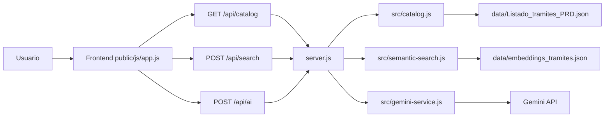

# Documentacion tecnica de TADI Search

## Objetivo

TADI Search es un mockup para evaluar una experiencia de busqueda de tramites TAD basada en tres mecanismos complementarios:

1. Busqueda predictiva con Fuse.js.
2. Busqueda semantica/textual con embeddings y refuerzo por coincidencia.
3. Analisis final con IA generativa.

La idea central es no depender de un unico ranking. Fuse.js recupera coincidencias textuales rapidas, la busqueda semantica/textual combina embeddings con coincidencias fuertes en nombre, keywords y descripcion, y Gemini decide entre candidatos reales del catalogo.

## Arquitectura



## Archivos principales

```text
server.js
  Expone endpoints y coordina catalogo, embeddings e IA.

src/catalog.js
  Lee y normaliza el catalogo PRD.

src/semantic-search.js
  Carga embeddings, limpia la consulta, calcula similitud coseno y aplica refuerzo textual.

src/gemini-service.js
  Construye prompts, llama a Gemini y normaliza la respuesta.

src/ai-usage-log.js
  Registra que se envio a Gemini y cuantos tokens reporto la API.

src/text-utils.js
  Utilidades compartidas de texto, porcentajes y limites.

public/js/app.js
  Controla UI, Fuse.js, armado de candidatos, render de tarjetas y llamada a endpoints.

public/css/app.css
  Estilos base compartidos y vista de testing con etiquetas de ranking.

public/production/index.html
  Entrada visual limpia para presentar la app sin etiquetas de testing.

public/production/styles.css
  Capa visual de la vista de presentacion TAD.

public/production/assets/
  Imagenes e iconos usados solo por la vista de presentacion.

scripts/generate-embeddings.js
  Regenera data/embeddings_tramites.json.
```

## Datos usados

Catalogo fuente:

```text
data/Listado_tramites_PRD.json
```

Campos leidos:

```json
{
  "ID": 1,
  "NOMBRE_TRAMITE": "...",
  "DESCRIPCION_CORTA": "..."
}
```

Formato normalizado interno:

```json
{
  "id": 1,
  "nombre": "...",
  "descripcion": "...",
  "keywords": []
}
```

`DESCRIPCION_HTML` no se usa en el flujo actual.

## Configuracion editable

En `public/js/app.js`:

```js
const SEARCH_CONFIG = {
  predictiveVisibleLimit: null,
  fuseCandidateMinPercent: 46,
  includeExactNameWordsForAI: true,
  embeddingVisibleLimit: 50,
  embeddingCandidatesForAI: 10,
  aiCandidatesSentLimit: null,
  searchVisibleLimit: null,
};
```

Significado:

- `predictiveVisibleLimit`: cantidad mostrada mientras se escribe. `null` muestra todo.
- `fuseCandidateMinPercent`: umbral minimo de Fuse para candidato IA.
- `includeExactNameWordsForAI`: incluye candidatos si el nombre contiene todas las palabras de la busqueda.
- `embeddingVisibleLimit`: cantidad de resultados de busqueda semantica/textual pedidos al backend para visualizacion/testing.
- `embeddingCandidatesForAI`: cantidad de resultados de busqueda semantica/textual que entran como candidatos IA.
- `aiCandidatesSentLimit`: limite final de candidatos enviados a Gemini. `null` no recorta.
- `searchVisibleLimit`: limite visual despues de Buscar. `null` muestra todo lo disponible.

## 1. Busqueda Fuse.js

Implementacion:

```text
public/js/app.js
initFuse()
searchLocal()
enrichPredictiveResult()
getFuseCandidatesForSearch()
```

Campos usados:

- `nombre`, peso `0.55`.
- `descripcion`, peso `0.45`.

Configuracion Fuse:

```js
state.fuse = new Fuse(items, {
  keys: [
    { name: 'nombre', weight: 0.55 },
    { name: 'descripcion', weight: 0.45 },
  ],
  threshold: 0.42,
  minMatchCharLength: 2,
  includeScore: true,
  ignoreLocation: true,
});
```

Uso mientras se escribe:

- Se ejecuta en el navegador.
- Antes de consultar Fuse, se quitan palabras de intencion como `quiero`, `busco`, `hacer`, `necesito`, `tramite`, para que una frase como `busco hacer una partida` se busque como `partida`.
- Muestra coincidencias predictivas.
- Ordena por score interno de Fuse, de menor a mayor.
- La UI convierte ese score a `Fuse XX%` para que mayor sea mejor.

Detalle de limpieza:

```text
1. Convierte a minusculas.
2. Quita acentos.
3. Separa en palabras.
4. Elimina tokens de menos de 3 caracteres.
5. Elimina stopwords genericas de intencion, conectores y pronombres.
6. Une los terminos relevantes restantes.
```

Stopwords actuales:

```text
quiero, quisiera, deseo, necesito, necesitaria, tengo, busco, buscar, buscando,
hacer, realizar, iniciar, obtener, sacar, pedir, conseguir, ver, saber,
tramite, tramites, tramitar, gestion, gestionar, solicitud, solicitar,
una, uno, unos, unas, para, por, con, sin, del, los, las, que,
como, donde, cuando, sobre, este, esta, esto, mis, tus, sus
```

Ejemplo:

```text
Necesito hacer una partida urgente -> partida urgente
```

No deben agregarse como stopwords terminos de dominio que modifican la intencion, como:

```text
alta, baja, urgente, licencia, certificado, partida, domicilio
```

Uso al presionar Buscar:

Un tramite entra como candidato por Fuse si cumple al menos una condicion:

1. `Fuse >= fuseCandidateMinPercent`.
2. `includeExactNameWordsForAI` esta activo y el `nombre` contiene todas las palabras exactas buscadas.

La regla de palabras exactas se aplica solo sobre `nombre`, no sobre `descripcion`, para evitar sumar demasiados tramites.

Orden de prioridad:

1. Primero queda el orden original de Fuse.
2. Luego se agregan embeddings que no esten repetidos.
3. Si un tramite aparece por ambos metodos, se fusionan sus datos.

## 2. Busqueda semantica/textual

Implementacion:

```text
src/semantic-search.js
server.js -> POST /api/search
public/js/app.js -> searchByEmbedding()
```

Campos usados para generar embeddings:

- `nombre`.
- `descripcion`.
- `keywords`, si existen.

Texto vectorizado:

```text
Nombre:
{nombre}

Descripcion:
{descripcion}

Palabras clave:
{keywords}
```

Modelo:

```text
Xenova/paraphrase-multilingual-MiniLM-L12-v2
```

Herramienta:

```text
@huggingface/transformers
```

Flujo:

1. `scripts/generate-embeddings.js` genera `data/embeddings_tramites.json`.
2. En cada busqueda, Node limpia la consulta con stopwords compartidas.
3. Node genera el embedding de la consulta limpia.
4. Node compara la consulta contra los vectores guardados.
5. Se calcula similitud coseno.
6. Se calcula un refuerzo textual sobre `nombre`, `keywords` y `descripcion`.
7. Se ordena por el mejor score combinado de coincidencia semantica/textual.

Cantidades:

- Para visualizar/testing se piden `embeddingVisibleLimit` resultados.
- Para IA se toman solo los primeros `embeddingCandidatesForAI`.

Orden de prioridad:

- La busqueda semantica/textual no ordena solo por similitud coseno.
- El score final toma la mejor senal entre embedding y coincidencia textual fuerte.
- En modo IA, esta busqueda no reemplaza el orden de Fuse; suma candidatos adicionales y aporta score de coincidencia.

### Limpieza de consulta para embeddings

La consulta enviada por el usuario se limpia antes de generar el embedding.

Ejemplo:

```text
Busco hacer una partida -> partida
```

Esto evita que palabras genericas de intencion, como `busco` o `hacer`, desplacen el vector hacia conceptos amplios en lugar del objeto real de busqueda.

La consulta original se conserva para logs y para la IA.

### Refuerzo textual y ruido vectorial

El ruido vectorial aparece cuando el modelo de embeddings rankea alto tramites con cercanias semanticas debiles o accidentales, especialmente en textos largos.

Para mitigarlo, el backend revisa si los terminos relevantes aparecen en:

```text
nombre
keywords
descripcion
```

Si hay coincidencias fuertes, el tramite sube en el ranking aunque el embedding puro lo hubiera dejado bajo. Esto protege busquedas literales como `partida`, `partida urgente` o `certificado domicilio`.

## 3. Analisis y respuesta IA

Implementacion:

```text
src/gemini-service.js
server.js -> POST /api/ai
public/js/app.js -> requestAISuggestion()
renderAISuggestion()
```

Gemini no recibe todo el catalogo. Recibe candidatos ya filtrados.

Gemini recibe la consulta original completa, no la consulta limpia. La consulta limpia se usa para recuperar y rankear candidatos; la original se conserva para que la IA entienda la necesidad expresada y redacte una explicacion natural.

Ejemplo:

```text
Consulta original: Necesito hacer una partida
Consulta limpia para busqueda: partida
Texto que recibe Gemini: El usuario busca: "Necesito hacer una partida"
```

Esto permite respuestas del estilo:

```text
Si necesitas hacer una partida, el tramite mas adecuado es...
```

Candidatos enviados:

- Fuse: todos los que superan el porcentaje configurado o tienen palabras exactas en `nombre`.
- Busqueda semantica/textual: top `embeddingCandidatesForAI`.
- Duplicados: se eliminan por `id`.

Datos enviados por candidato:

- `id`
- `nombre`
- `descripcion` recortada a 450 caracteres
- `keywords`
- `fuseRank`
- `fuseScore`
- `embeddingRank`
- `scorePercent`
- `sources`
- `aiCandidateRank`

Registro de consumo:

- Cada llamado real a Gemini se registra en `logs/ai-usage.md`.
- Tambien se guarda una version estructurada en `logs/ai-usage.ndjson`.
- El log incluye fecha, modelo, candidatos enviados y `usageMetadata` de Gemini.

Respuesta esperada:

```json
{
  "principal": {
    "id": "...",
    "razon": "explicacion breve"
  },
  "alternativas": [
    {
      "id": "...",
      "razon": "explicacion breve"
    }
  ],
  "explicacion": "texto breve para el usuario"
}
```

Orden de prioridad:

1. Gemini debe elegir solo entre candidatos enviados.
2. Puede priorizar candidatos que aparecen por Fuse y embeddings.
3. Puede elegir un candidato que solo vino por busqueda semantica/textual si responde mejor.
4. Devuelve un principal y hasta 3 alternativas.

## Modos de visualizacion

### Mientras se escribe

Muestra resultados Fuse:

- `Predictiva #N`
- `Fuse XX%`

### Buscar con IA apagada

Muestra resultados de busqueda semantica/textual:

- `Busqueda #N`
- `Coincidencia XX%`
- Si el tramite tambien aparecio en Fuse, agrega `Predictiva #N` y `Fuse XX%`.

### Buscar con IA encendida

Muestra candidatos IA y sugerencia:

- `Predictiva #N`, si viene de Fuse.
- `Fuse XX%`.
- `Busqueda #N`, si aparece en busqueda semantica/textual.
- `Coincidencia XX%`.
- `Nombre exacto`, si entro por palabras exactas en nombre.
- `IA cand. #N`.
- `Sugerido`, para el principal elegido por Gemini.

## Debug en consola

Al presionar Buscar, `public/js/app.js` registra el flujo completo en la consola del navegador, tanto en `/` como en `/produccion`.

Grupos emitidos:

```text
[TADI Search] Busqueda iniciada
[TADI Search] Resultados Fuse
[TADI Search] Candidatos Fuse que pasan filtro IA
[TADI Search] Request busqueda semantica/textual
[TADI Search] Top busqueda semantica/textual
[TADI Search] Candidatos combinados para IA
[TADI Search] Request IA
[TADI Search] Candidatos enviados a IA
[TADI Search] Respuesta IA
[TADI Search] Resumen tokens IA
============================== FIN BUSQUEDA TADI ==============================
```

Esto permite auditar porcentajes, rankings, candidatos recuperados y candidatos enviados a IA aunque la vista `/produccion` no muestre tags visuales.

`Resumen tokens IA` contiene solo dos valores para lectura rapida:

```text
tokensTramitesEnviadosEstimados
tokensTotalesConsumidos
```

El primer valor se estima localmente a partir de los candidatos enviados a IA. El segundo viene del `usageMetadata.totalTokenCount` reportado por Gemini.

## Comentarios sobre limpieza

Se separo el backend en modulos:

- Catalogo: `src/catalog.js`.
- IA: `src/gemini-service.js`.
- Embeddings: `src/semantic-search.js`.
- Utilidades: `src/text-utils.js`.

Tambien se elimino estado de frontend sin uso (`aiPending`). Los archivos `.log`, `.env`, `node_modules`, `.venv` y caches de Python estan ignorados por `.gitignore`.
