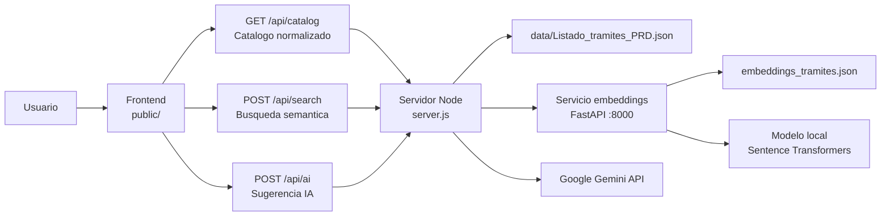

# Documentacion de la aplicacion TADI Search

## Resumen ejecutivo

TADI Search es un mockup funcional para evaluar una mejora del buscador de tramites de la plataforma TAD (Tramites a Distancia).

La propuesta combina tres niveles de busqueda:

1. Busqueda predictiva: mientras la persona escribe, se muestran coincidencias rapidas del catalogo.
2. Busqueda semantica por embeddings: al presionar Buscar o Enter, se ordenan los tramites por similitud de significado, no solo por coincidencia exacta de palabras.
3. Sugerencia con IA: opcionalmente, Google Gemini recibe los mejores candidatos y elige un tramite principal con alternativas.

El objetivo del mockup no es reemplazar el buscador productivo, sino demostrar una experiencia posible para encontrar tramites a partir de lenguaje natural.

## Que problema intenta resolver

En un catalogo de tramites, la persona usuaria no siempre conoce el nombre exacto del tramite. Puede buscar por necesidad, por ejemplo:

```text
quiero renovar mi licencia
necesito registrar un perro
permiso para obra
```

Una busqueda tradicional puede fallar si las palabras no coinciden exactamente con el nombre del tramite. Los embeddings ayudan a comparar textos por cercania semantica, y Gemini ayuda a explicar cual de los resultados parece ser el mas adecuado.

## Alcance del mockup

Incluye:

- Catalogo local de tramites en JSON.
- Busqueda predictiva en el navegador.
- Busqueda semantica local por embeddings.
- Integracion con Google Gemini para sugerencia asistida.
- Servidor Node.js para centralizar catalogo, busqueda e IA.
- Servicio local Python/FastAPI para embeddings.

No incluye:

- Autenticacion de usuarios.
- Persistencia en base de datos.
- Integracion real con sistemas productivos de TAD.
- Analitica de uso.
- Panel administrativo.

## Arquitectura general



## Componentes principales

### 1. Frontend

Ubicacion:

```text
public/index.html
public/css/app.css
public/js/app.js
```

Responsabilidades:

- Mostrar la interfaz del buscador.
- Cargar el catalogo desde `GET /api/catalog`.
- Ejecutar busqueda predictiva con Fuse.js mientras se escribe.
- Ejecutar la busqueda semantica cuando se presiona Buscar o Enter.
- Enviar a Gemini solo los candidatos ya filtrados.
- Renderizar resultados, porcentaje de acierto y sugerencias de IA.

Implementacion principal:

- `public/js/app.js`
  - `initApp()`: inicializa eventos y carga inicial.
  - `loadCatalog()`: pide el catalogo al backend.
  - `initFuse(items)`: crea el indice de busqueda predictiva.
  - `searchLocal(query)`: devuelve resultados predictivos.
  - `runSearch(ui)`: dispara la busqueda semantica y luego la IA si corresponde.
  - `searchByEmbedding(query)`: llama a `POST /api/search`.
  - `requestAISuggestion(ui, query, results)`: llama a `POST /api/ai`.
  - `renderAISuggestion(ui, data)`: muestra el tramite principal y alternativas.

### 2. Servidor Node.js

Ubicacion:

```text
server.js
```

Responsabilidades:

- Servir la app estatica.
- Leer y normalizar el catalogo PRD.
- Exponer endpoints para el frontend.
- Hacer de intermediario entre el navegador y el servicio de embeddings.
- Hacer de intermediario entre el navegador y Gemini, sin exponer la clave de API.

Endpoints:

```http
GET /api/catalog
```

Devuelve el catalogo normalizado.

```http
POST /api/search
```

Recibe:

```json
{
  "q": "texto buscado",
  "top_k": 15
}
```

Consulta el servicio local de embeddings y devuelve resultados con score.

```http
POST /api/ai
```

Recibe la consulta y una lista corta de candidatos ya filtrados. Llama a Gemini y devuelve una recomendacion estructurada.

Implementacion principal:

- `getCatalog()`: lee el JSON una sola vez y lo mantiene en memoria.
- `normalizeCatalog(rawCatalog)`: transforma el listado PRD al formato usado por la app.
- `searchWithEmbeddings(query, topK)`: llama al servicio FastAPI local.
- `normalizeEmbeddingResult(result, catalogById)`: asegura que el resultado use los datos oficiales del catalogo.
- `findProcedureWithGemini(query, candidates)`: ejecuta el llamado a Gemini.
- `buildSystemPrompt()`: define las reglas generales para Gemini.
- `buildUserPrompt(query, candidates)`: arma el contenido que se envia a Gemini.
- `normalizeGeminiResponse(payload)`: valida y normaliza la respuesta de Gemini.

### 3. Catalogo de datos

Ubicacion:

```text
data/Listado_tramites_PRD.json
```

Campos usados:

```json
{
  "ID": 3,
  "NOMBRE_TRAMITE": "...",
  "DESCRIPCION_CORTA": "..."
}
```

La aplicacion normaliza esos campos a:

```json
{
  "id": 3,
  "nombre": "...",
  "descripcion": "..."
}
```

Notas:

- `DESCRIPCION_CORTA` se usa para busqueda predictiva, embeddings y contexto de IA.
- `DESCRIPCION_HTML` no se usa actualmente.
- El catalogo se cachea en memoria al ser leido por `server.js`.

### 4. Servicio de embeddings

Ubicacion:

```text
paquete-embeddings-buscador/
```

Responsabilidades:

- Cargar la base vectorizada de tramites.
- Convertir la consulta del usuario en un vector.
- Comparar ese vector contra los vectores del catalogo.
- Devolver los tramites mas parecidos por similitud coseno.

Archivos principales:

- `paquete-embeddings-buscador/backend/app.py`
  - Define la API FastAPI.
  - Expone `GET /health`.
  - Expone `POST /buscar`.

- `paquete-embeddings-buscador/backend/search_core.py`
  - Ejecuta la busqueda semantica.
  - Usa `cosine_similarity` para ordenar resultados.

- `paquete-embeddings-buscador/backend/modelo.py`
  - Carga el modelo `paraphrase-multilingual-MiniLM-L12-v2`.

- `paquete-embeddings-buscador/backend/generar_embeddings.py`
  - Regenera `embeddings_tramites.json` cuando cambia el catalogo.

- `paquete-embeddings-buscador/backend/embeddings_tramites.json`
  - Contiene los vectores ya generados.
  - Evita recalcular embeddings de todos los tramites en cada busqueda.

### 5. Gemini

La IA no recibe todo el catalogo. Recibe solamente:

- La consulta escrita por la persona.
- Hasta 6 candidatos preseleccionados.
- Para cada candidato:
  - `id`
  - `nombre`
  - `descripcion` recortada
  - porcentaje de acierto semantico si esta disponible

Esto reduce consumo de tokens y evita que Gemini tenga que resolver sobre cientos de tramites.

La clave de Gemini queda en `.env`:

```text
GEMINI_API_KEY=...
GEMINI_MODEL=gemini-2.5-flash-lite
```

El backend usa esa clave desde `server.js`. El navegador nunca la recibe.

## Flujo de uso

1. La persona abre `http://localhost:3002`.
2. El frontend carga el catalogo con `GET /api/catalog`.
3. Mientras escribe, Fuse.js muestra resultados predictivos.
4. Al presionar Buscar o Enter, el frontend llama a `POST /api/search`.
5. Node llama al servicio local de embeddings en `http://127.0.0.1:8000/buscar`.
6. FastAPI devuelve resultados ordenados por similitud semantica.
7. El frontend muestra los resultados y el porcentaje de acierto.
8. Si el toggle IA esta activo, el frontend envia hasta 6 candidatos a `POST /api/ai`.
9. Node consulta Gemini.
10. Gemini responde un tramite principal y hasta 3 alternativas.
11. El frontend muestra la sugerencia destacada.

## Busqueda predictiva

La busqueda predictiva se ejecuta en el navegador con Fuse.js.

Implementacion:

```text
public/js/app.js
```

Funciones:

- `initFuse(items)`
- `searchLocal(query)`
- `handleInput(ui)`

Caracteristicas:

- Se ejecuta mientras la persona escribe.
- Busca en `nombre` y `descripcion`.
- Es rapida porque trabaja con el catalogo ya cargado en memoria del navegador.
- Sirve como feedback inmediato, antes de ejecutar la busqueda semantica.

## Busqueda semantica por embeddings

La busqueda semantica se ejecuta cuando la persona confirma la busqueda.

Implementacion:

```text
public/js/app.js                         -> searchByEmbedding()
server.js                                -> searchWithEmbeddings()
paquete-embeddings-buscador/backend/app.py -> POST /buscar
```

La idea es comparar significados. Por ejemplo, una consulta puede no tener las mismas palabras exactas que el nombre del tramite, pero aun asi estar semanticamente cerca.

El ranking usa:

- Texto de consulta del usuario.
- Vectores precalculados del catalogo.
- Similitud coseno.

## Sugerencia con IA

Gemini se usa despues de la busqueda semantica, no antes.

Implementacion:

```text
public/js/app.js -> requestAISuggestion()
server.js        -> findProcedureWithGemini()
server.js        -> buildSystemPrompt()
server.js        -> buildUserPrompt()
```

La respuesta esperada de Gemini es JSON:

```json
{
  "principal": {
    "id": "...",
    "razon": "explicacion breve"
  },
  "alternativas": [
    {
      "id": "...",
      "razon": "explicacion breve"
    }
  ],
  "explicacion": "texto breve para el usuario"
}
```

Reglas principales:

- Gemini solo puede elegir entre los candidatos enviados.
- No puede inventar IDs.
- Si ningun candidato sirve, debe devolver `principal: null`.
- Las alternativas estan limitadas a 3.

## Como ejecutar localmente

Instalar dependencias:

```bash
npm install
```

Ejecutar todo junto:

```bash
npm run search
```

Abrir:

```text
http://localhost:3002
```

## Ejecucion por separado

Terminal 1:

```powershell
npm run start:embeddings
```

Terminal 2:

```bash
npm start
```

## Variables de entorno

Archivo:

```text
.env
```

Ejemplo:

```text
GEMINI_API_KEY=...
GEMINI_MODEL=gemini-2.5-flash-lite
EMBEDDING_SEARCH_URL=http://127.0.0.1:8000/buscar
PORT=3002
```

Notas:

- `.env` no debe subirse a GitHub.
- `.env.example` documenta las variables esperadas.
- Si no hay `GEMINI_API_KEY`, la busqueda semantica puede funcionar igual, pero no la sugerencia con IA.

## Como regenerar embeddings

Si cambia `data/Listado_tramites_PRD.json`, hay que regenerar la base vectorizada:

```powershell
cd paquete-embeddings-buscador
.\.venv\Scripts\python.exe backend\generar_embeddings.py
```

El script:

1. Lee el JSON de tramites.
2. Normaliza `ID`, `NOMBRE_TRAMITE` y `DESCRIPCION_CORTA`.
3. Construye un texto por tramite.
4. Genera un vector con Sentence Transformers.
5. Guarda o actualiza `backend/embeddings_tramites.json`.

## Decisiones tecnicas relevantes

- El catalogo se mantiene como JSON local para simplificar el mockup.
- Los embeddings se precalculan una vez y se guardan en archivo para evitar costos en cada busqueda.
- Gemini recibe pocos candidatos para reducir tokens y mantener control sobre la respuesta.
- Node centraliza las llamadas externas para no exponer claves en el navegador.
- La busqueda predictiva y la semantica conviven: una da rapidez, la otra mejora relevancia.

## Limitaciones actuales

- El servicio de embeddings debe estar levantado para que funcione la busqueda semantica.
- El score de embeddings es una medida de similitud, no una garantia de que el tramite sea correcto.
- Gemini depende de la calidad de los candidatos que recibe.
- La app no guarda historial ni feedback de usuarios.
- El catalogo se actualiza reemplazando el JSON y regenerando embeddings.

## Mapa rapido de archivos

```text
server.js
  Backend principal Node/Express.

public/js/app.js
  Logica de interfaz, busqueda predictiva, llamada a embeddings y llamada a IA.

public/index.html
  Estructura HTML de la pantalla.

public/css/app.css
  Estilos visuales del mockup.

data/Listado_tramites_PRD.json
  Catalogo fuente usado por la app.

paquete-embeddings-buscador/backend/app.py
  API local de embeddings.

paquete-embeddings-buscador/backend/search_core.py
  Ranking semantico por similitud coseno.

paquete-embeddings-buscador/backend/generar_embeddings.py
  Generacion o actualizacion de vectores.

paquete-embeddings-buscador/backend/embeddings_tramites.json
  Base vectorizada de tramites.

scripts/ensure-embeddings.ps1
  Script auxiliar para iniciar embeddings si no esta disponible.
```
