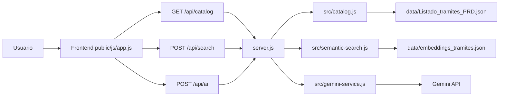

# Documentacion tecnica de TADI Search

## Objetivo

TADI Search es un mockup para evaluar una experiencia de busqueda de tramites TAD basada en tres mecanismos complementarios:

1. Busqueda predictiva con Fuse.js.
2. Busqueda semantica por embeddings.
3. Analisis final con IA generativa.

La idea central es no depender de un unico ranking. Fuse.js recupera coincidencias textuales, embeddings recupera similitud semantica y Gemini decide entre candidatos reales del catalogo.

## Arquitectura



## Archivos principales

```text
server.js
  Expone endpoints y coordina catalogo, embeddings e IA.

src/catalog.js
  Lee y normaliza el catalogo PRD.

src/semantic-search.js
  Carga embeddings, genera el embedding de la consulta y calcula similitud coseno.

src/gemini-service.js
  Construye prompts, llama a Gemini y normaliza la respuesta.

src/text-utils.js
  Utilidades compartidas de texto, porcentajes y limites.

public/js/app.js
  Controla UI, Fuse.js, armado de candidatos, render de tarjetas y llamada a endpoints.

scripts/generate-embeddings.js
  Regenera data/embeddings_tramites.json.
```

## Datos usados

Catalogo fuente:

```text
data/Listado_tramites_PRD.json
```

Campos leidos:

```json
{
  "ID": 1,
  "NOMBRE_TRAMITE": "...",
  "DESCRIPCION_CORTA": "..."
}
```

Formato normalizado interno:

```json
{
  "id": 1,
  "nombre": "...",
  "descripcion": "...",
  "keywords": []
}
```

`DESCRIPCION_HTML` no se usa en el flujo actual.

## Configuracion editable

En `public/js/app.js`:

```js
const SEARCH_CONFIG = {
  predictiveVisibleLimit: null,
  fuseCandidateMinPercent: 46,
  includeExactNameWordsForAI: true,
  embeddingVisibleLimit: 50,
  embeddingCandidatesForAI: 10,
  aiCandidatesSentLimit: null,
  searchVisibleLimit: null,
};
```

Significado:

- `predictiveVisibleLimit`: cantidad mostrada mientras se escribe. `null` muestra todo.
- `fuseCandidateMinPercent`: umbral minimo de Fuse para candidato IA.
- `includeExactNameWordsForAI`: incluye candidatos si el nombre contiene todas las palabras de la busqueda.
- `embeddingVisibleLimit`: cantidad de resultados embeddings pedidos al backend para visualizacion/testing.
- `embeddingCandidatesForAI`: cantidad de embeddings que entran como candidatos IA.
- `aiCandidatesSentLimit`: limite final de candidatos enviados a Gemini. `null` no recorta.
- `searchVisibleLimit`: limite visual despues de Buscar. `null` muestra todo lo disponible.

## 1. Busqueda Fuse.js

Implementacion:

```text
public/js/app.js
initFuse()
searchLocal()
enrichPredictiveResult()
getFuseCandidatesForSearch()
```

Campos usados:

- `nombre`, peso `0.55`.
- `descripcion`, peso `0.45`.

Configuracion Fuse:

```js
state.fuse = new Fuse(items, {
  keys: [
    { name: 'nombre', weight: 0.55 },
    { name: 'descripcion', weight: 0.45 },
  ],
  threshold: 0.42,
  minMatchCharLength: 2,
  includeScore: true,
  ignoreLocation: true,
});
```

Uso mientras se escribe:

- Se ejecuta en el navegador.
- Antes de consultar Fuse, se quitan palabras de intencion como `quiero`, `hacer`, `necesito`, `tramite`, para que una frase como `quiero hacer una partida` se busque como `partida`.
- Muestra coincidencias predictivas.
- Ordena por score interno de Fuse, de menor a mayor.
- La UI convierte ese score a `Fuse XX%` para que mayor sea mejor.

Uso al presionar Buscar:

Un tramite entra como candidato por Fuse si cumple al menos una condicion:

1. `Fuse >= fuseCandidateMinPercent`.
2. `includeExactNameWordsForAI` esta activo y el `nombre` contiene todas las palabras exactas buscadas.

La regla de palabras exactas se aplica solo sobre `nombre`, no sobre `descripcion`, para evitar sumar demasiados tramites.

Orden de prioridad:

1. Primero queda el orden original de Fuse.
2. Luego se agregan embeddings que no esten repetidos.
3. Si un tramite aparece por ambos metodos, se fusionan sus datos.

## 2. Busqueda por embeddings

Implementacion:

```text
src/semantic-search.js
server.js -> POST /api/search
public/js/app.js -> searchByEmbedding()
```

Campos usados para generar embeddings:

- `nombre`.
- `descripcion`.
- `keywords`, si existen.

Texto vectorizado:

```text
Nombre:
{nombre}

Descripcion:
{descripcion}

Palabras clave:
{keywords}
```

Modelo:

```text
Xenova/paraphrase-multilingual-MiniLM-L12-v2
```

Herramienta:

```text
@huggingface/transformers
```

Flujo:

1. `scripts/generate-embeddings.js` genera `data/embeddings_tramites.json`.
2. En cada busqueda, Node genera el embedding de la consulta.
3. Node compara la consulta contra los vectores guardados.
4. Se calcula similitud coseno.
5. Se ordena de mayor a menor similitud.

Cantidades:

- Para visualizar/testing se piden `embeddingVisibleLimit` resultados.
- Para IA se toman solo los primeros `embeddingCandidatesForAI`.

Orden de prioridad:

- Embeddings siempre ordena por similitud coseno descendente.
- En modo IA, embeddings no reemplaza el orden de Fuse; suma candidatos adicionales y aporta score semantico.

## 3. Analisis y respuesta IA

Implementacion:

```text
src/gemini-service.js
server.js -> POST /api/ai
public/js/app.js -> requestAISuggestion()
renderAISuggestion()
```

Gemini no recibe todo el catalogo. Recibe candidatos ya filtrados.

Candidatos enviados:

- Fuse: todos los que superan el porcentaje configurado o tienen palabras exactas en `nombre`.
- Embeddings: top `embeddingCandidatesForAI`.
- Duplicados: se eliminan por `id`.

Datos enviados por candidato:

- `id`
- `nombre`
- `descripcion` recortada a 450 caracteres
- `keywords`
- `fuseRank`
- `fuseScore`
- `embeddingRank`
- `scorePercent`
- `sources`
- `aiCandidateRank`

Respuesta esperada:

```json
{
  "principal": {
    "id": "...",
    "razon": "explicacion breve"
  },
  "alternativas": [
    {
      "id": "...",
      "razon": "explicacion breve"
    }
  ],
  "explicacion": "texto breve para el usuario"
}
```

Orden de prioridad:

1. Gemini debe elegir solo entre candidatos enviados.
2. Puede priorizar candidatos que aparecen por Fuse y embeddings.
3. Puede elegir un candidato que solo vino por embeddings si semanticamente responde mejor.
4. Devuelve un principal y hasta 3 alternativas.

## Modos de visualizacion

### Mientras se escribe

Muestra resultados Fuse:

- `Predictiva #N`
- `Fuse XX%`

### Buscar con IA apagada

Muestra resultados embeddings:

- `Embedding #N`
- `Embedding XX%`
- Si el tramite tambien aparecio en Fuse, agrega `Predictiva #N` y `Fuse XX%`.

### Buscar con IA encendida

Muestra candidatos IA y sugerencia:

- `Predictiva #N`, si viene de Fuse.
- `Fuse XX%`.
- `Embedding #N`, si aparece en embeddings.
- `Embedding XX%`.
- `Nombre exacto`, si entro por palabras exactas en nombre.
- `IA cand. #N`.
- `Sugerido`, para el principal elegido por Gemini.

## Comentarios sobre limpieza

Se separo el backend en modulos:

- Catalogo: `src/catalog.js`.
- IA: `src/gemini-service.js`.
- Embeddings: `src/semantic-search.js`.
- Utilidades: `src/text-utils.js`.

Tambien se elimino estado de frontend sin uso (`aiPending`). Los archivos `.log`, `.env`, `node_modules`, `.venv` y caches de Python estan ignorados por `.gitignore`.
